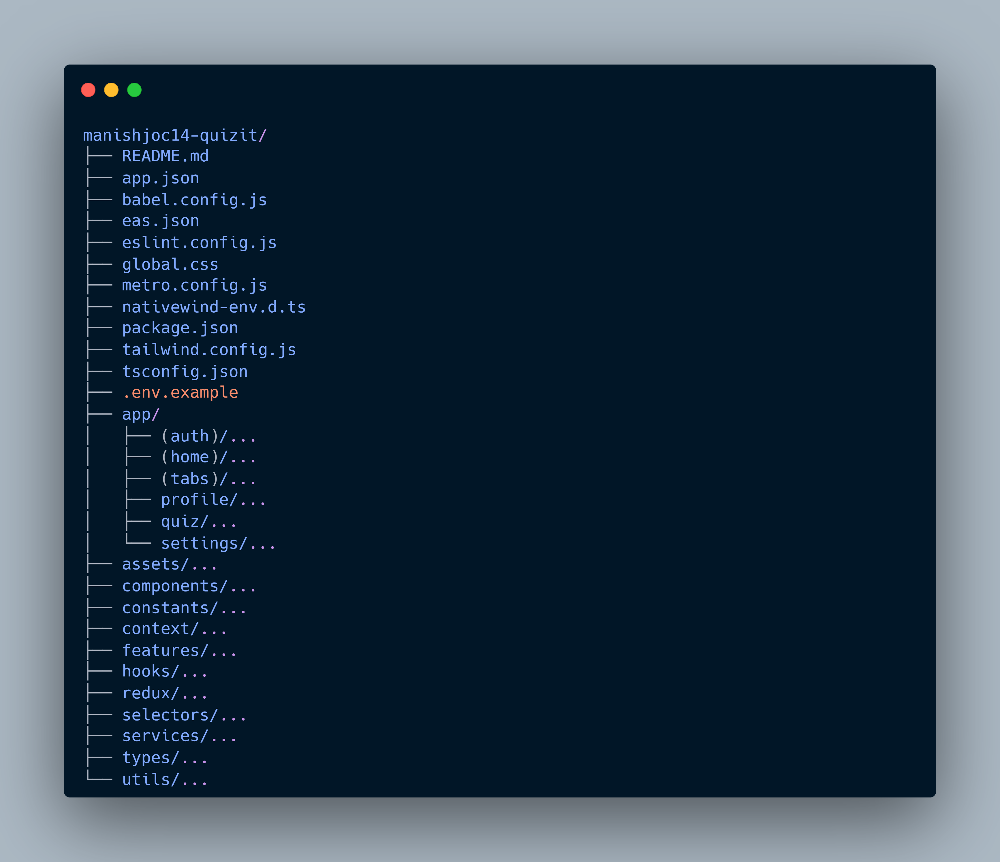
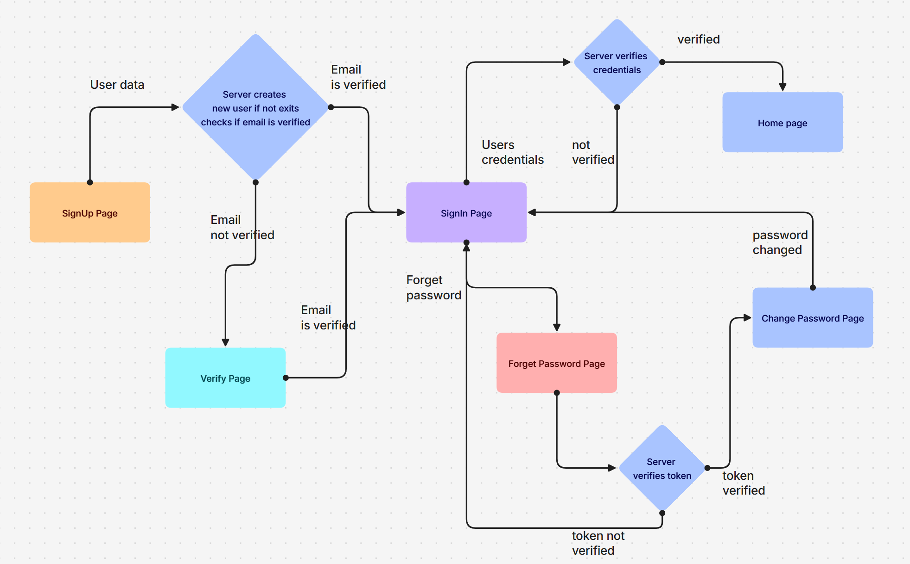
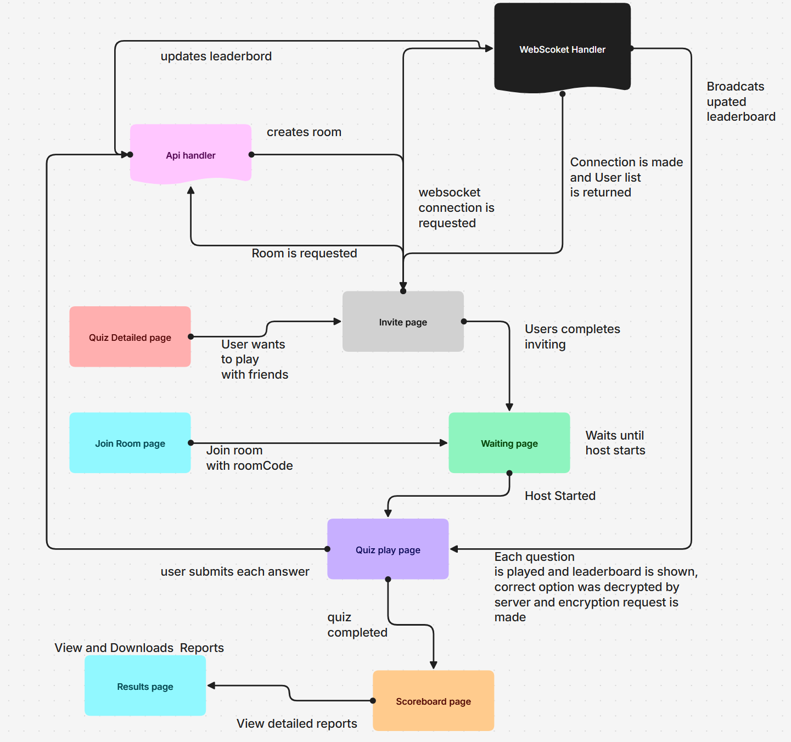
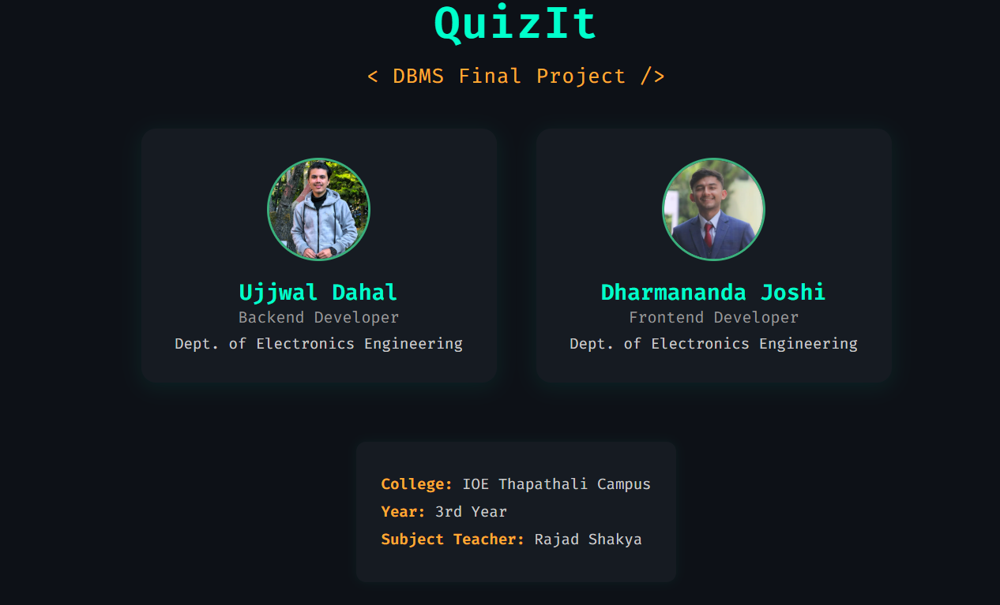

# **📱 QuizIt - Think Fast Play Smart**

[](https://quizit.expo.app/)


<p align="center">
  
</p>  

**QuizIt** is a **real-time multiplayer quiz platform** built with **React Native + Expo** and powered by a **FastAPI backend**.
Create, host, invite, join, and play quizzes with friends or the community — all in a **fast, secure, and mobile-first** experience.

---

## 🚀 **Core Features**

* **🔐 Authentication & Security** — Sign up, sign in, email verification, password reset
* **📝 Quiz Management** — Create, update, delete quizzes anytime
* **⚡ Real-Time Multiplayer** — Play live with WebSocket updates
* **📩 Friend Invites** — Invite friends before starting; automatic email notifications
* **📚 Explore & Library** — Browse trending, latest, and your own quizzes
* **⭐ Favorites** — Save quizzes to your personal library for quick access
* **🤝 Social Features** — Follow players, explore their quizzes, view profiles
* **🔍 Player Search** — Find other players by name and view their profiles
* **🌙 Light/Dark Mode** — Full theme support for comfort
* **📊 Leaderboard** — Live position updates during games
* **🔒 Secure Options** — Quiz answers encrypted with Fernet until revealed
* **📄 Downloadable Results** — Get rank, points, and question-by-question reviews as a PDF
* **🛠 Profile Management** — Update your avatar, bio, and details
* **📬 Feedback & Support** — Contact us directly from the app
* **📱 Cross-Platform** — Works on Web, Android, and iOS

---

## 🛠 **Tech Stack**

* **React Native** (Expo)
* **TypeScript** (fully typed, scalable architecture)
* **NativeWind (TailwindCSS)** for styling
* **Expo Router** for navigation
* **Redux Toolkit + RTK Query** for state & API management
* **React Native Reanimated** for animations
* **Expo Secure Store** & **AsyncStorage** for secure local storage
* **Expo Print & Sharing** for downloadable results

---

## 📂 **Project Structure**

<p align="center">
  
</p>  

---

## 🔐 **Simplified Auth Flow**

<p align="center">
  
</p>  

---

## 🎮 **Simplified QuizPlayer Flow**

<p align="center">
  
</p>  

---

## ⚡ **Getting Started**

## 1️⃣ Clone the repository
```bash
git clone https://github.com/ManishJoc14/QuizIt
cd quizit
```

## 2️⃣ Install dependencies
```bash
npm install
```
## 3️⃣ Configure environment variables
copy .env.example to .env

```bash
EXPO_PUBLIC_PROTOCOL=http://
EXPO_PUBLIC_BASEURL=your-backend-url.com
```
## 4️⃣ Start the app
```bash
npx expo start
```

---

## 🤝 **Contributing**
Fork, branch, commit, push, and PR

```bash
git checkout -b feature/awesome-feature
git commit -m "Add awesome feature"
git push origin feature/awesome-feature
```

---

## 👥 **Our Team**

<p align="center">
  
</p>  

---
